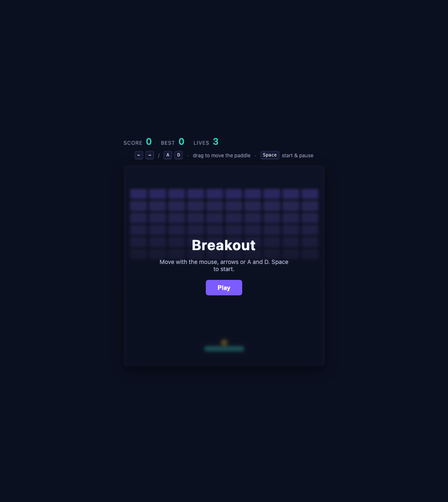
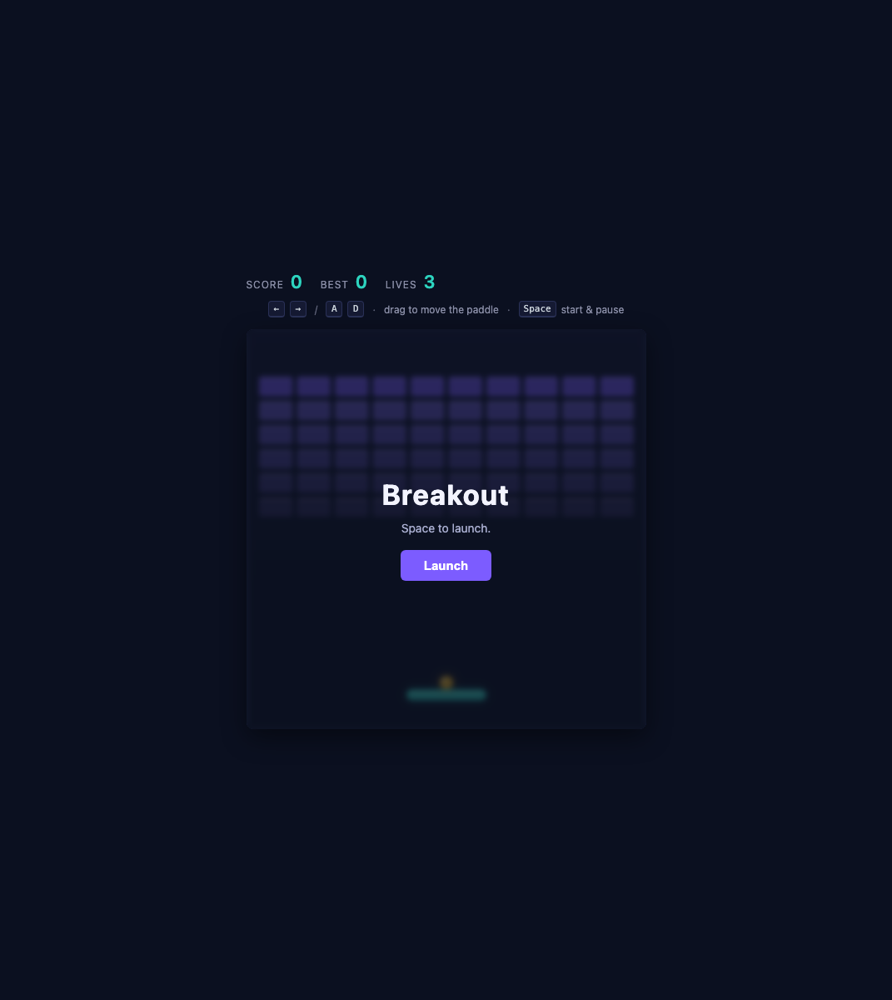
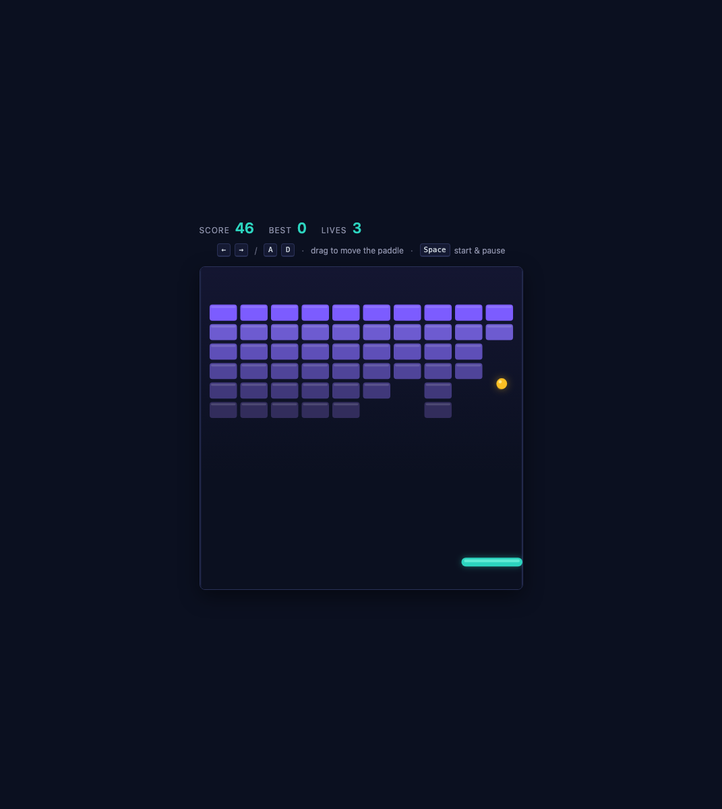
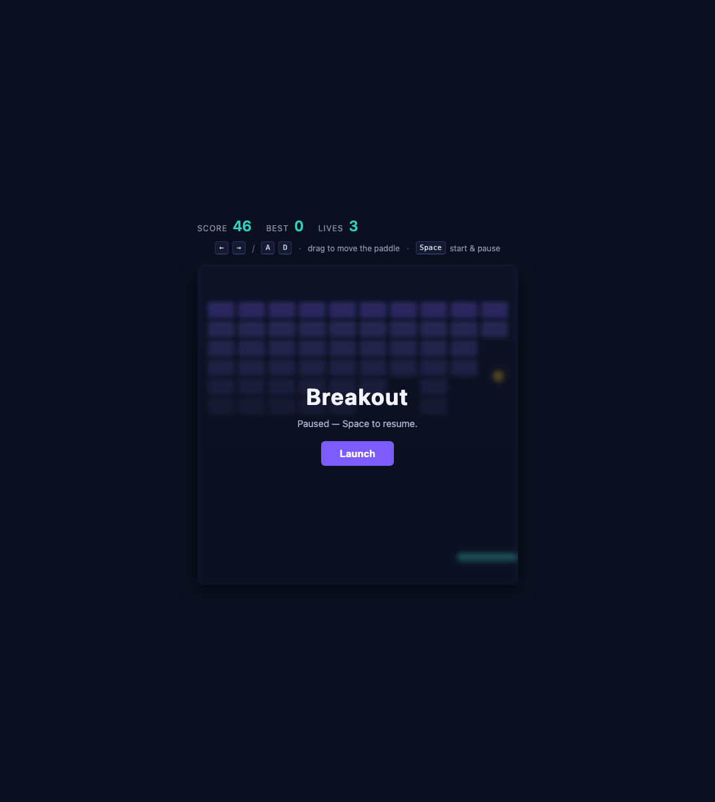

# Breakout

A classic Breakout arcade game that runs right inside an Axon editor tab.

Bounce the ball off the paddle, clear all sixty bricks, and keep your three lives.

## Install

1. Open the Extensions view in Axon (`⇧⌘X`).
2. Switch to the **Downloads** tab.
3. Find **Breakout** and press **Install**.
4. Open the game from the Extensions view (`Open`), via the **Open Breakout**
   command in the command palette (`⇧⌘P`), or from the game webview tab once
   it has been opened.

## Gameplay

|                 |                 |
| :-------------: | :-------------: |
|  |  |
|  |  |

## How to play

- **Move** — drag anywhere on the board, or use the arrow keys or `A` `D`
- **Start / pause** — `Space` or `Enter`
- Where the ball lands on the paddle decides where it goes, so the far edges are
  the sharpest angles.
- Each row is worth a different number of points, from **1** at the bottom to **6**
  at the top, so clearing from the top down is worth much more than farming the
  cheap rows.
- The ball **speeds up** with every brick you clear, and your **paddle narrows**
  from 96px down to 62px, so a run gets harder the further you get.
- Letting the ball past the paddle costs a life. You have **three**.
- Your **best score** is remembered across sessions.

## Source

Part of the [axon-editor/extensions](https://github.com/axon-editor/extensions/tree/main/extensions) marketplace, in the
[axon.breakout](https://github.com/axon-editor/extensions/tree/main/extensions/axon.breakout) folder.
Published by the Axon Editor Group.
