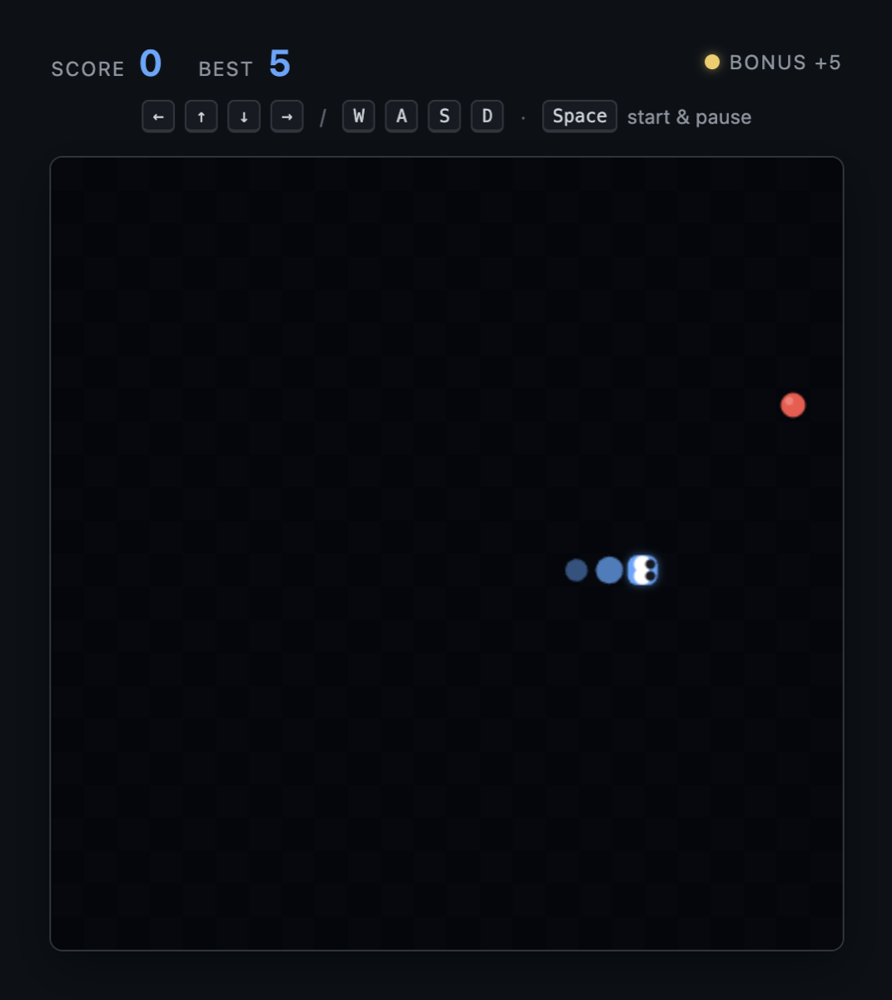
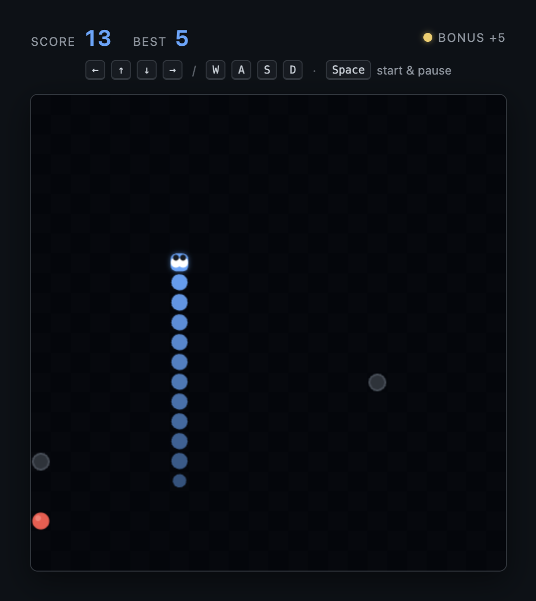
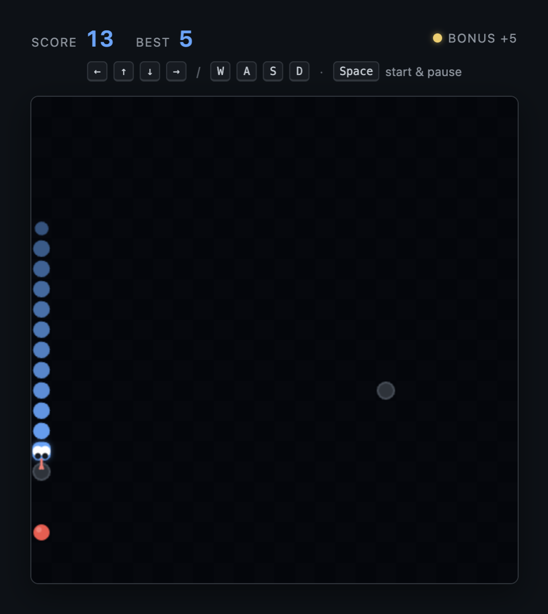
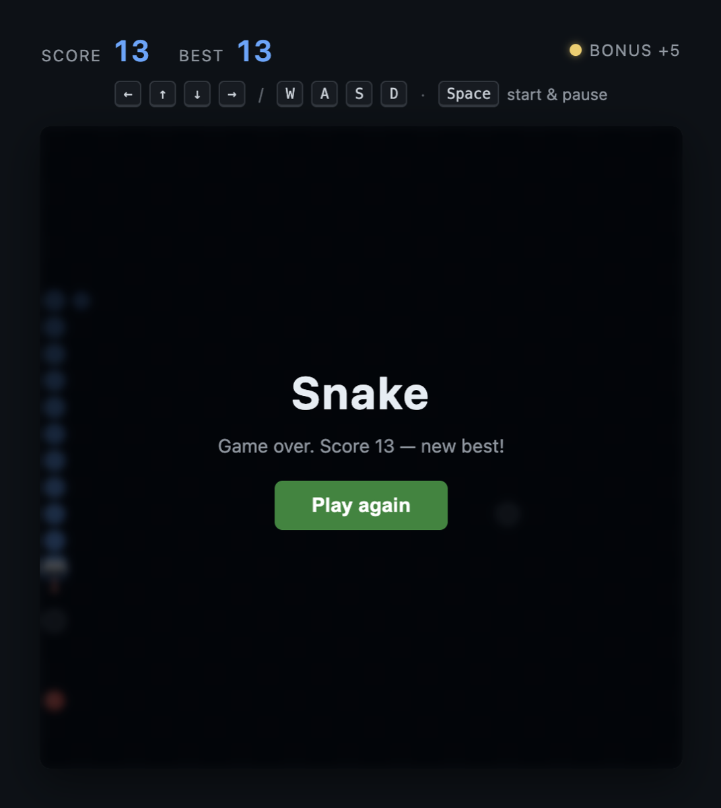

# Snake

A classic Snake arcade game that runs right inside an Axon editor tab.

Chase the red squares, grow the snake, and avoid the walls and yourself.

## Install

1. Open the Extensions view in Axon (`⇧⌘X`).
2. Switch to the **Downloads** tab.
3. Find **Snake** and press **Install**.
4. Open the game from the Extensions view (`Open`), via the **Open Snake**
   command in the command palette (`⇧⌘P`), or from the game webview tab once
   it has been opened.

## Gameplay

|                 |                 |
| :-------------: | :-------------: |
|  |  |
|  |  |

## How to play

- **Move** — arrow keys or `W` `A` `S` `D`
- **Start / restart** — `Space` or `Enter`
- Eating a red **apple** grows the snake and increases your score.
- Eating a golden **bonus apple** (+5) awards extra points before it expires.
- Watch out for **obstacles** — they appear as you score and the snake must
  slither around them.
- Hitting a **wall**, an **obstacle**, or your own **tail** ends the run.
- Your **best score** is remembered across sessions.

## Source

Part of the [axon-editor/extensions](https://github.com/axon-editor/extensions/tree/main/extensions) marketplace, in the
[axon.snake](https://github.com/axon-editor/extensions/tree/main/extensions/axon.snake) folder.
Published by the Axon Editor Group.